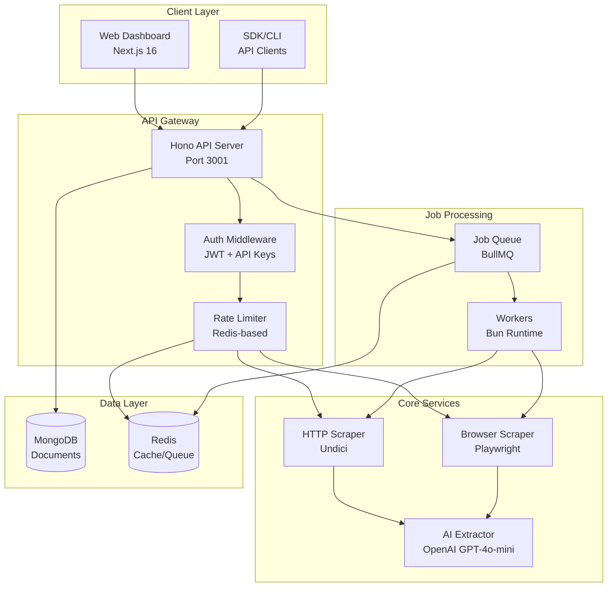
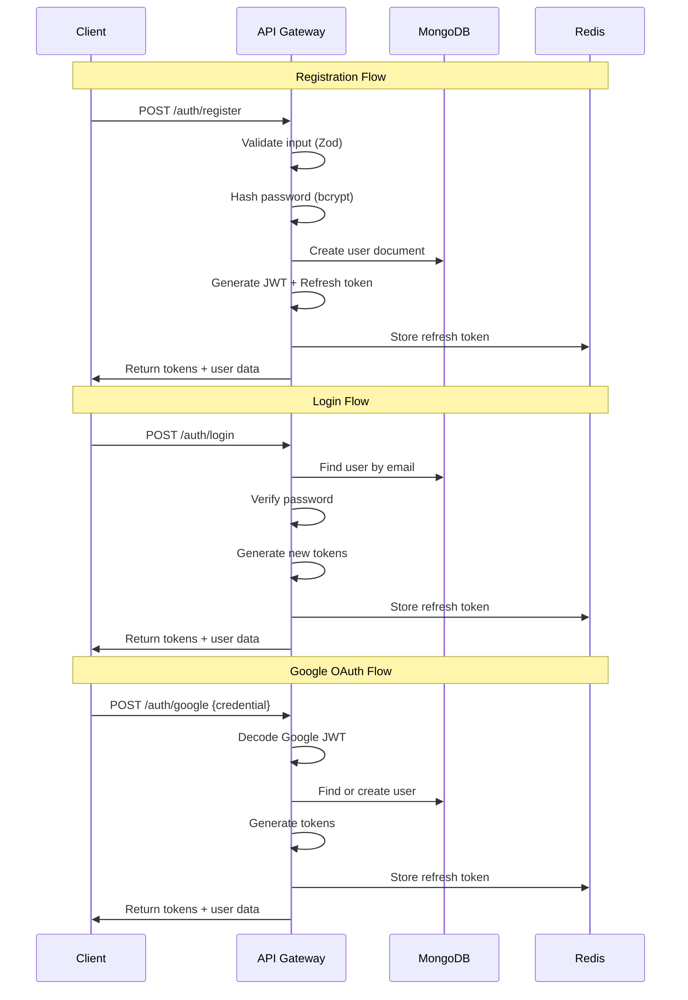
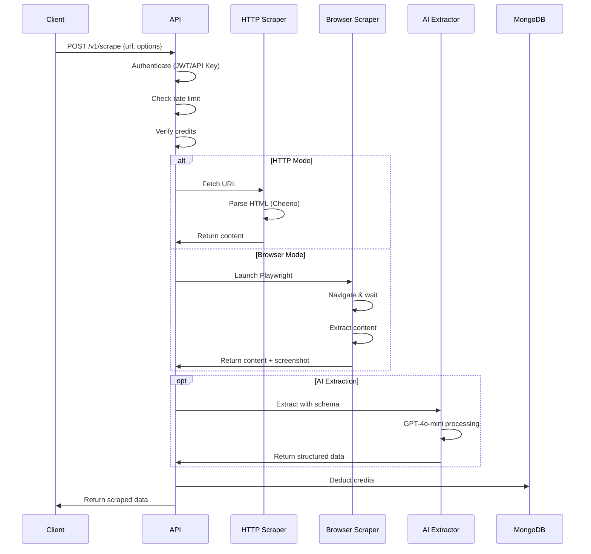
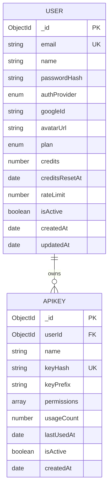
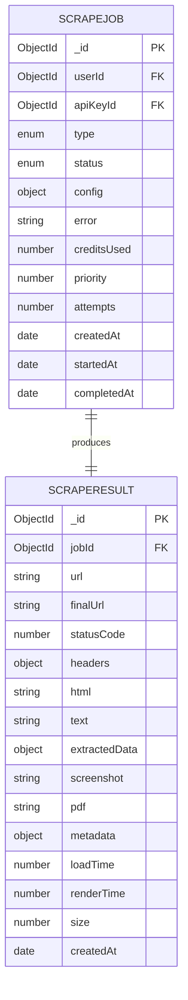
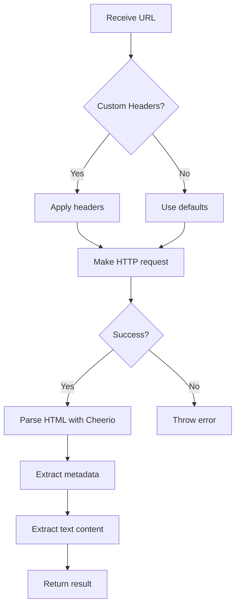
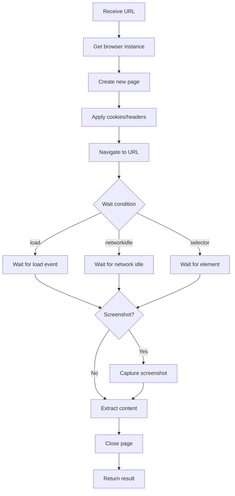
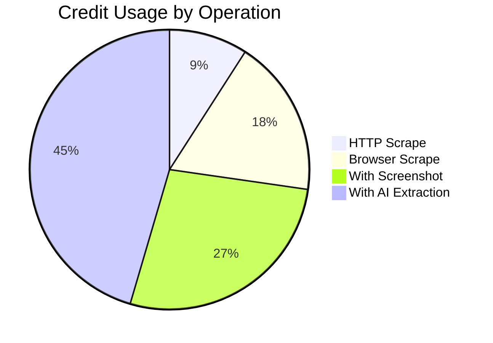
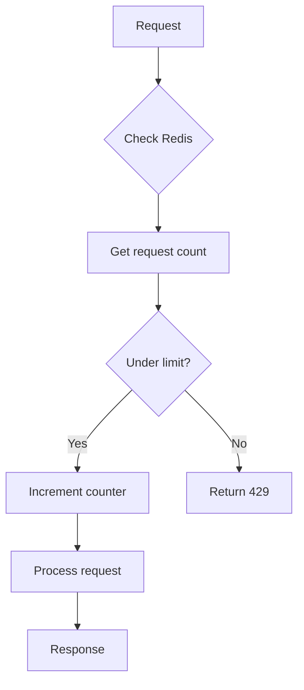

# ScrapePilot Architecture

This document describes the technical architecture of ScrapePilot, an intelligent web scraping API platform.

## System Overview

ScrapePilot is built as a modern monorepo using Turborepo with Bun as the package manager. It consists of a Next.js frontend and a Hono backend API, sharing common packages for types and database models.



## Directory Structure

```
ScrapePilot.ai/
├── apps/
│   ├── web/                    # Next.js 16 frontend
│   │   ├── src/
│   │   │   ├── app/            # App router pages
│   │   │   ├── components/     # React components
│   │   │   ├── contexts/       # React contexts (auth)
│   │   │   └── lib/            # Utilities & API client
│   │   └── package.json
│   │
│   └── api/                    # Hono backend API
│       ├── src/
│       │   ├── routes/         # API route handlers
│       │   ├── middleware/     # Auth, rate limiting
│       │   ├── services/       # Business logic
│       │   │   ├── scraper/    # HTTP & browser scrapers
│       │   │   ├── queue/      # BullMQ job processing
│       │   │   └── ai/         # OpenAI integration
│       │   ├── workers/        # Background job workers
│       │   └── config/         # Environment config
│       └── package.json
│
├── packages/
│   ├── shared/                 # Shared types & validators
│   │   └── src/
│   │       ├── types/          # TypeScript interfaces
│   │       ├── validators/     # Zod schemas
│   │       └── constants/      # Plan configs, etc.
│   │
│   ├── database/               # MongoDB models & Redis
│   │   └── src/
│   │       ├── models/         # Mongoose models
│   │       ├── connection.ts   # MongoDB connection
│   │       └── redis.ts        # Redis client
│   │
│   └── tsconfig/               # Shared TypeScript configs
│
├── docker/
│   └── docker-compose.yml      # MongoDB + Redis containers
│
└── docs/                       # Documentation
```

## Request Flow

### Authentication Flow



### Scraping Flow



## Data Models

### User Model



### Job & Result Models



## API Endpoints

### Authentication

| Method | Endpoint | Description |
|--------|----------|-------------|
| POST | `/auth/register` | Register new user |
| POST | `/auth/login` | Login with email/password |
| POST | `/auth/google` | Login with Google OAuth |
| POST | `/auth/refresh` | Refresh access token |
| POST | `/auth/logout` | Logout (invalidate refresh token) |
| GET | `/auth/me` | Get current user |

### Scraping

| Method | Endpoint | Description |
|--------|----------|-------------|
| POST | `/v1/scrape` | Scrape a URL (sync) |
| POST | `/v1/scrape/screenshot` | Scrape with screenshot |
| POST | `/v1/scrape/extract` | Scrape with AI extraction |

### API Keys

| Method | Endpoint | Description |
|--------|----------|-------------|
| GET | `/api-keys` | List user's API keys |
| POST | `/api-keys` | Create new API key |
| DELETE | `/api-keys/:id` | Revoke API key |

## Scraper Implementation

### HTTP Scraper

The HTTP scraper uses Undici for fast HTTP requests and Cheerio for HTML parsing.



**Features:**
- Custom headers support
- Cookie handling
- Automatic redirect following
- HTML to text extraction
- Metadata extraction (title, description, links, images)

### Browser Scraper

The browser scraper uses Playwright for JavaScript rendering.



**Features:**
- Full JavaScript execution
- Screenshot capture (PNG/JPEG)
- PDF generation
- Custom viewport settings
- Wait conditions (load, networkidle, selector)
- Cookie and header injection

## Credit System



| Plan | Monthly Credits | Rate Limit |
|------|-----------------|------------|
| Free | 1,000 | 10 req/min |
| Starter | 10,000 | 60 req/min |
| Pro | 100,000 | 300 req/min |
| Enterprise | Unlimited | Custom |

## Security

### Authentication

- **JWT Tokens**: Short-lived access tokens (15 min)
- **Refresh Tokens**: Long-lived, stored in Redis (7 days)
- **API Keys**: Hashed with SHA-256, prefix `sp_live_`
- **Google OAuth**: JWT verification without secrets needed

### Rate Limiting



- Per-user rate limiting based on plan
- Redis-based sliding window
- Graceful degradation on Redis failure

### Input Validation

All inputs validated with Zod schemas:
- Email format validation
- URL validation
- Timeout limits (1-60 seconds)
- Schema structure validation

## Deployment

### Development

```bash
# Start databases
bun run db:start

# Start all services
bun run dev
```

### Production

```bash
# Build all packages
bun run build

# Start API
cd apps/api && bun run start

# Start worker (separate process)
cd apps/api && bun run worker:start

# Start web
cd apps/web && bun run start
```

### Docker

```yaml
# docker-compose.yml includes:
- MongoDB 7 (port 27017)
- Redis 7 Alpine (port 6379)
```

## Environment Variables

See `.env.example` for all configuration options:

- `MONGODB_URI` - MongoDB connection string
- `REDIS_URL` - Redis connection string
- `JWT_SECRET` - Secret for JWT signing
- `OPENAI_API_KEY` - OpenAI API key (optional)
- `GOOGLE_CLIENT_ID` - Google OAuth client ID (optional)
